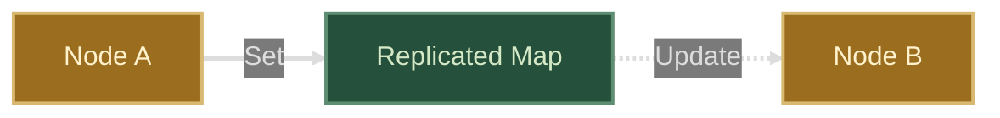

# Replicated Map

Replicated maps provide a mechanism for sharing data across distributed nodes
and receiving events when the data changes.



## Overview

Pulse replicated maps leverage Redis hashes and pub/sub to maintain replicated
in-memory copies of a map across multiple nodes. Any change to the map is
automatically replicated to all nodes and results in a notification that can be
used to trigger actions.

Upon joining a replicated map the node receives an up-to-date snapshot of its
content. The replicated map then guarantees that any change to the map results
in a notification.

## Usage

### basics
```go
package main

import (
	"context"
	"fmt"
	"os"
	"sync"

	"github.com/redis/go-redis/v9"
	"github.com/apus-run/gala/components/rmap"
)

func main() {
	ctx := context.Background()

	// Create Redis client
	rdb := redis.NewClient(&redis.Options{Addr: "localhost:6379", Password: os.Getenv("REDIS_PASSWORD")})

	// Make sure Redis is up and running and we can connect to it
	if err := rdb.Ping(ctx).Err(); err != nil {
		panic(err)
	}

	// Join replicated map
	m, err := rmap.Join(ctx, "basics", rdb)
	if err != nil {
		panic(err)
	}
	defer m.Close()

	// Reset the map
	if err := m.Reset(ctx); err != nil {
		panic(err)
	}

	// Write a string
	if _, err := m.Set(ctx, "stringval", "bar"); err != nil {
		panic(err)
	}

	// Set returns the previous value
	old, err := m.Set(ctx, "stringval", "baz")
	if err != nil {
		panic(err)
	}
	fmt.Printf("%q: old value for stringval: %v\n", m.Name, old)

	// Delete a key
	prev, err := m.Delete(ctx, "stringval")
	if err != nil {
		panic(err)
	}
	fmt.Printf("%q: deleted stringval: %v\n", m.Name, prev)

	// Append to a list
	if _, err := m.AppendValues(ctx, "listval", "first", "second"); err != nil {
		panic(err)
	}

	// Append returns the new values of the list
	vals, err := m.AppendValues(ctx, "listval", "third")
	if err != nil {
		panic(err)
	}
	fmt.Printf("%q: new values for listval: %v\n", m.Name, vals)

	// Remove elements from a list and return the new content
	vals, removed, err := m.RemoveValues(ctx, "listval", "first")
	if err != nil {
		panic(err)
	}
	fmt.Printf("%q: new values for listval: %v, removed: %v\n", m.Name, vals, removed)

	// Increment an integer, starts at 0
	if _, err := m.Inc(ctx, "intval", 1); err != nil {
		panic(err)
	}

	// Increment returns the new value
	val, err := m.Inc(ctx, "intval", 1)
	if err != nil {
		panic(err)
	}
	fmt.Printf("%q: new value for intval: %v\n", m.Name, val)

	// Print a single value
	st, ok := m.Get("stringval")
	fmt.Printf("%q: stringval: %v, ok: %v\n", m.Name, st, ok)

	// Print all keys
	keys := m.Keys()
	fmt.Printf("%q: keys: %v\n", m.Name, keys)

	// Print the number of items in the map
	ln := m.Len()
	fmt.Printf("%q: len: %v\n", m.Name, ln)

	// Print the final map
	content := m.Map()
	fmt.Printf("%q: final content: %v\n", m.Name, content)

	// Subscribe to changes and make sure to unsubscribe when done
	c := m.Subscribe()
	defer m.Unsubscribe(c)

	// Start a goroutine to listen for updates and stop when it gets one
	var wg sync.WaitGroup
	wg.Add(1)
	go func() {
		defer wg.Done()
		<-c
	}()

	// Send updates
	if _, err := m.Set(ctx, "foo", "bar"); err != nil {
		panic(err)
	}

	// Wait for the updates to be received
	fmt.Println("waiting for updates...")
	wg.Wait()
	fmt.Printf("Got update, %q: %v\n", m.Name, m.Map())
}
```

### multi-nodes
```go
package main

import (
	"context"
	"fmt"
	"os"
	"strconv"
	"sync"

	"github.com/redis/go-redis/v9"
	"github.com/apus-run/gala/components/rmap"
)

// Number of items to write to the map
const numitems = 9

func main() {
	ctx := context.Background()

	// Create Redis client
	rdb := redis.NewClient(&redis.Options{Addr: "localhost:6379", Password: os.Getenv("REDIS_PASSWORD")})

	// Make sure Redis is up and running and we can connect to it
	if err := rdb.Ping(ctx).Err(); err != nil {
		panic(err)
	}

	// Join replicated map
	m, err := rmap.Join(ctx, "multinodes", rdb)
	if err != nil {
		panic(err)
	}

	if len(os.Args) > 1 && os.Args[1] == "--write" {
		// Reset the map
		if err := m.Reset(ctx); err != nil {
			panic(err)
		}

		// Send updates
		for i := 0; i < numitems; i++ {
			if _, err := m.Set(ctx, "foo-"+strconv.Itoa(i+1), "bar"); err != nil {
				panic(err)
			}
		}

		// Exit
		os.Exit(0)
	}

	// Start a goroutine to listen for updates
	var wg sync.WaitGroup
	wg.Add(1)
	go func() {
		defer wg.Done()
		c := m.Subscribe()
		for range c {
			fmt.Printf("%q: %v keys\n", m.Name, m.Len())
			if m.Len() == numitems {
				break
			}
		}
	}()

	// Wait for the updates to be received
	fmt.Println("waiting for updates...")
	wg.Wait()

	// Print the final map
	fmt.Printf("%q: final content: %v\n", m.Name, m.Map())
}
```

## How It Works

Here's a breakdown:

* The Redis client is created by specifying the Redis server's address and
  password (if available). This client will be used to communicate with the
  Redis server.

```go
rdb := redis.NewClient(&redis.Options{Addr: "localhost:6379", Password: os.Getenv("REDIS_PASSWORD")})
```

* The code checks if the Redis server is running and accessible by sending a
  Ping command. If the Ping fails, the program panics.

```go
if err := rdb.Ping(ctx).Err(); err != nil {
	panic(err)
}
```

* The replicated map is joined using the rmap.Join function,
  which takes the Redis client as an argument. This function returns a
  replicated map object (`m`) and an error (if any).

```go
m, err := rmap.Join(ctx, "multinodes", rdb)
```

* If the command-line argument `--write` is provided, the code resets the map
  using `m.Reset`. This clears any existing data in the map. Then, a loop is
  used to write numitems key-value pairs to the map using `m.Set`.

```go
if len(os.Args) > 1 && os.Args[1] == "--write" {
	// Reset the map
	if err := m.Reset(ctx); err != nil {
		panic(err)
	}

	// Send updates
	for i := 0; i < numitems; i++ {
		if _, err := m.Set(ctx, "foo-"+strconv.Itoa(i+1), "bar"); err != nil {
			panic(err)
		}
	}
}
```

* A goroutine is started to listen for updates on the map. It subscribes to the
  map using m.Subscribe().

```go
go func() {
	defer wg.Done()
	c := m.Subscribe()
```

* Inside the goroutine, a loop is entered to wait for updates by receiving from
  the channel c. Each time an update is received, the code prints the number of
  keys in the map using m.Len(). If the number of keys reaches numitems, the
  loop is broken.

```go
for range c {
	fmt.Printf("%q: %v keys\n", m.Name, m.Len())
	if m.Len() == numitems {
		break
	}
}
```

* The main goroutine prints "waiting for updates..." and waits for the updates
  to be received by using `wg.Wait()`. This ensures that all updates are received
  before proceeding.

* Finally, the code prints the final content of the map using `m.Map()`. This
  function returns a snapshot of the current key-value pairs in the map.

In summary, this code demonstrates how to use the rmap package to create a
replicated map using Redis as the underlying storage. It shows how to write data
to the map, subscribe to updates, and retrieve the final content of the map. The
package provides a convenient way to build fault-tolerant distributed systems by
leveraging Redis's replication capabilities.